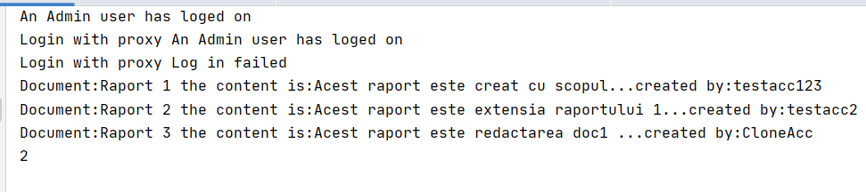

# Topic: Structural DP
## Author: Lesco Andrei
------
## Acomplished Objectives :
__1. I have studied and understood the Structural Design Patterns;__

__2. The domain chosen is "IT BankSystem inside a big company".__

__3. In this project I have chosen The next SDP: Decorator,Flyweight and Proxy__
## Introduction:
In software engineering, structural design patterns are used to make efficient standards regaring class compositions and object structures.

## Implementation
> * Decorator - There is an Admin that needs some extra permisions to the system. Like writing the code of the system.
For this I have used decorator to give the Admin User some different behaviour.
        
     public class SuperDecorator extends UserDecorator {
     
         public SuperDecorator(User decoratedUser) {
             super(decoratedUser);
         }
     
         @Override
         public String getUserType() {
             return "SuperUser";
         }
         
         
     
     
         @Override
         public User getClone(String account,String password) {
             return new SuperDecorator(decoratedUser.getClone(account,password));
         }
     
     }
 In the code snipet we see that we have implemented Decorator, that changes the behaviour of the User(in our case the type of the user),but saving the behaviour from old type.
 

> * Proxy - I have used proxy to control the access to accouts.
The signing up is happening through Proxy.
        
    public class ProxyClass implements ILogin{
        public User user;
        public ProxyClass(){
    
        }
        public ProxyClass(User user){
            this.user=user;
        }
        @Override
        public String login(String account, String password) {
           
                return user.login(account,password);
        }
    }
In this snipet we can see that we can log in with the proxy.

> * Flyweight - In bank system users uses hundreds of documents per day. And in order to reduce the  redundant info, we can use Flywheight to reduce the redundant info.
in this project the redundant info is regarding the file info.
    
    public class DocumentFactory {
       public static Map<String, DocType> docTypes = new HashMap<>();
    
        public static DocType getDocType(String encoding,String icon,String extention,String fullName) {
            DocType result = docTypes.get(extention);
            if (result == null) {
                result = new DocType(encoding, icon, extention, fullName);
                docTypes.put(extention, result);
            }
            return result;
        }
    
    }
In this snipet we see that our class checks if the file exist, the redundant part should not be stored in memory.

# ScreenShot

